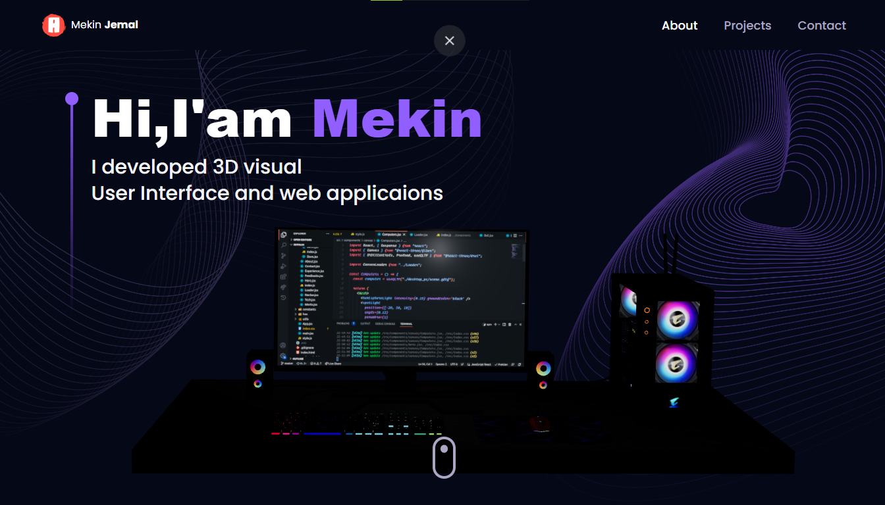
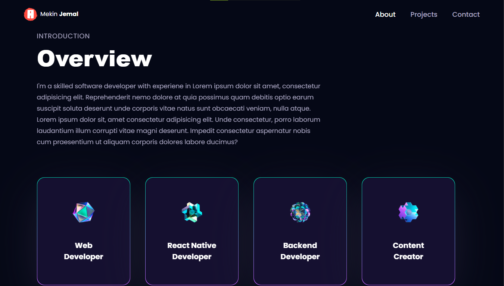
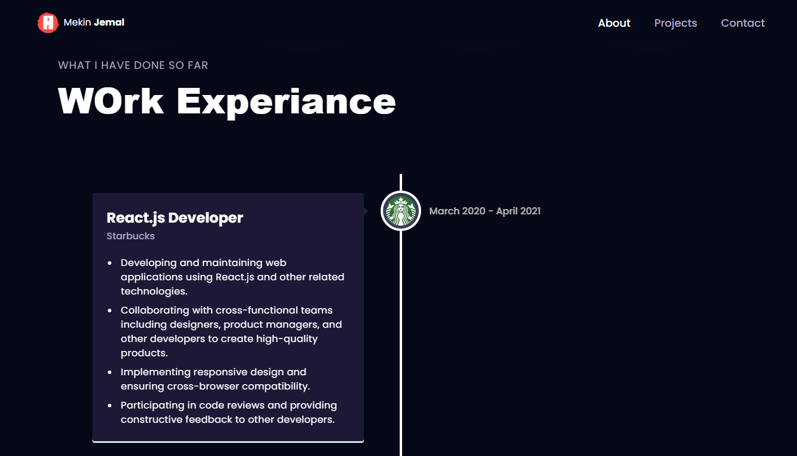
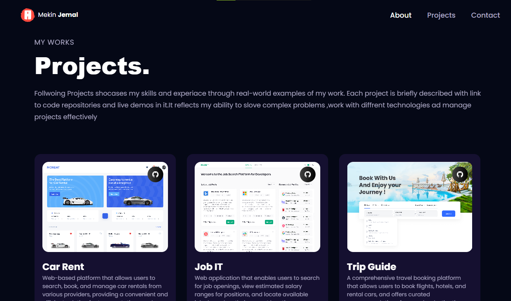
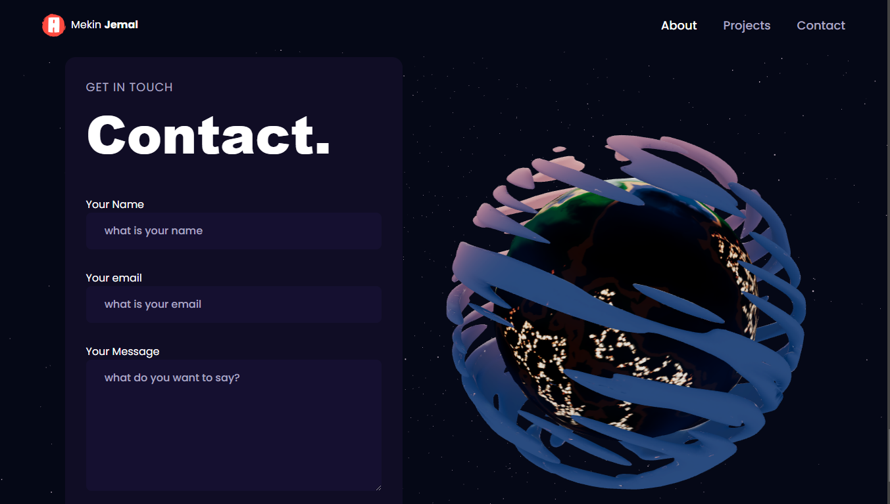

# 3D Portfolio Frontend

This project is the frontend of a 3D portfolio website. It showcases various 3D models and animations to create an interactive and visually appealing portfolio.

## Features

- Interactive 3D models
- Smooth animations
- Responsive design
- Easy navigation

## Technologies Used

- HTML
- CSS
- JavaScript
- Three.js

## Getting Started

### Prerequisites

- Node.js
- npm (Node Package Manager)

### Installation

1. Clone the repository:
   ```bash
   git clone https://github.com/yourusername/3D-Portfolio.git
   ```
2. Navigate to the project directory:
   ```bash
   cd 3D-Portfolio/Frontend
   ```
3. Install the dependencies:
   ```bash
   npm install
   ```

### Running the Project

1. Start the development server:
   ```bash
   npm start
   ```
2. Open your browser and go to `http://localhost:3000` to view the project.

## Deployment

To deploy the project, follow these steps:

1. Build the project:
   ```bash
   npm run build
   ```
2. Deploy the contents of the `build` directory to your web server.

## Contributing

If you would like to contribute to this project, please fork the repository and submit a pull request.

## License

This project is licensed under the MIT License.

## Contact

For any inquiries, please contact [your email address].

## Screenshots

Here are some screenshots of the project:







## Acknowledgements

- Thanks to the Three.js community for their excellent documentation and examples.
- Special thanks to [Person's Name] for their guidance and support.

## Future Improvements

- Add more 3D models and animations.
- Implement a dark mode.
- Improve performance and loading times.
- Add unit and integration tests.

## FAQ

**Q: How can I add my own 3D models?**
A: You can add your own 3D models by placing them in the `models` directory and updating the relevant JavaScript files to load your models.

**Q: Can I use this project for my own portfolio?**
A: Yes, you can use this project as a template for your own portfolio. Just make sure to give credit to the original project.

**Q: How can I report an issue or bug?**
A: You can report issues or bugs by opening an issue on the project's GitHub repository.
